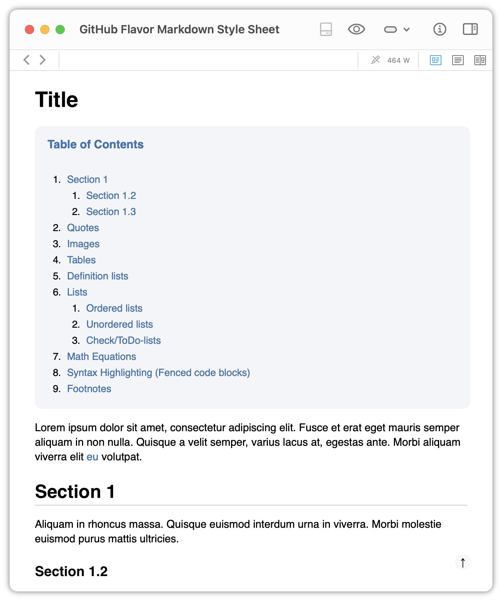
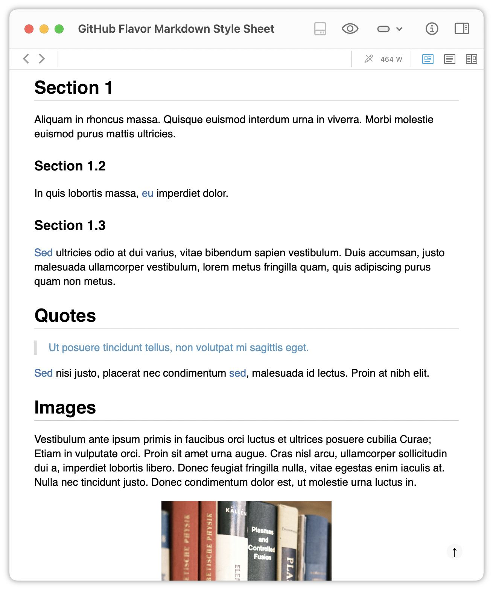
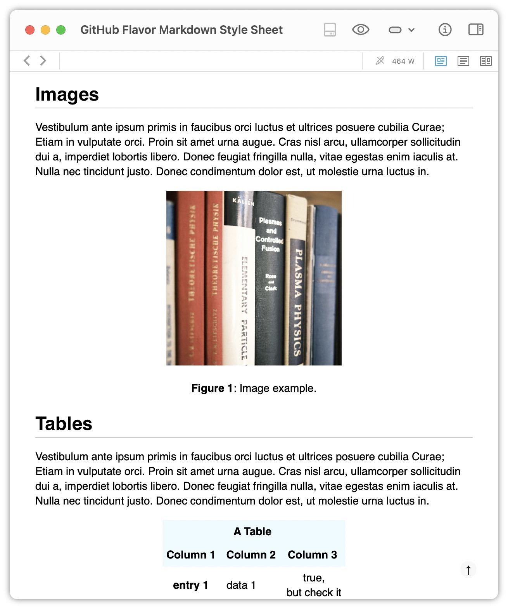
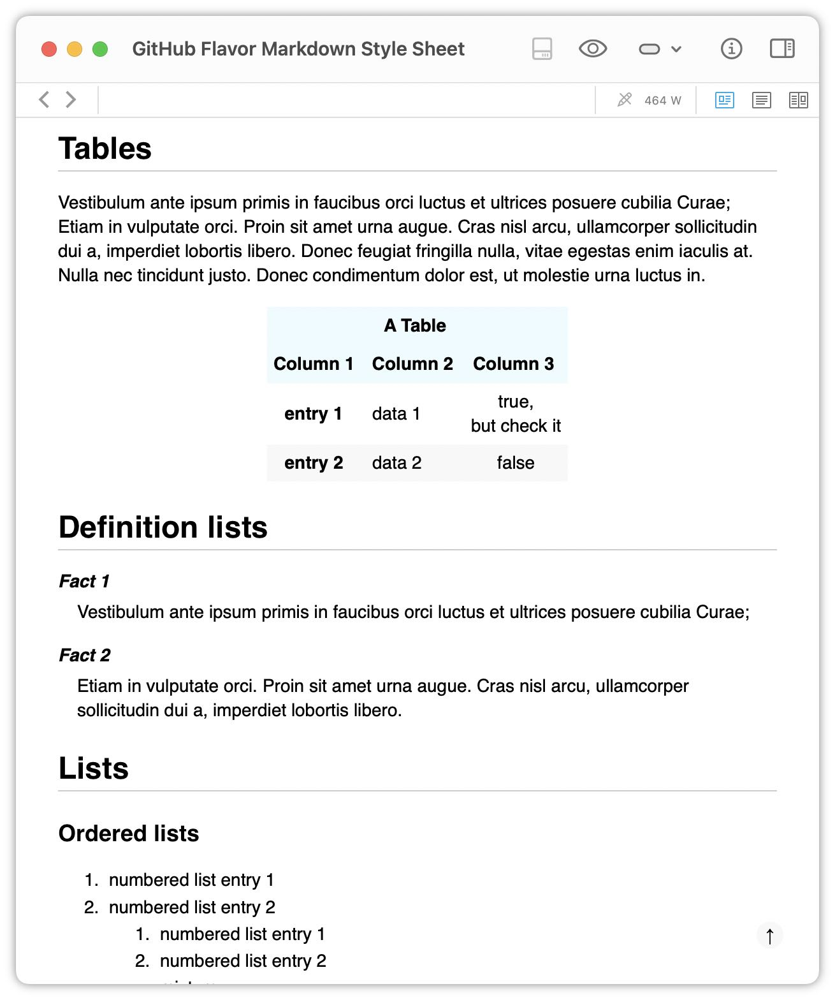
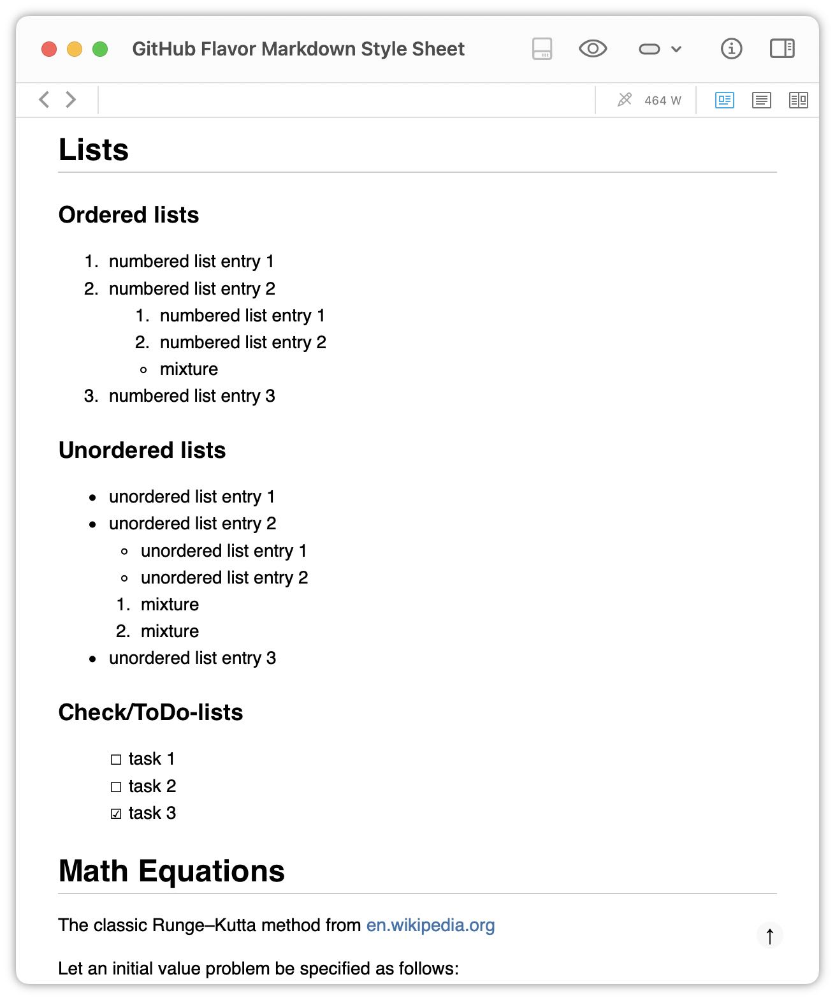
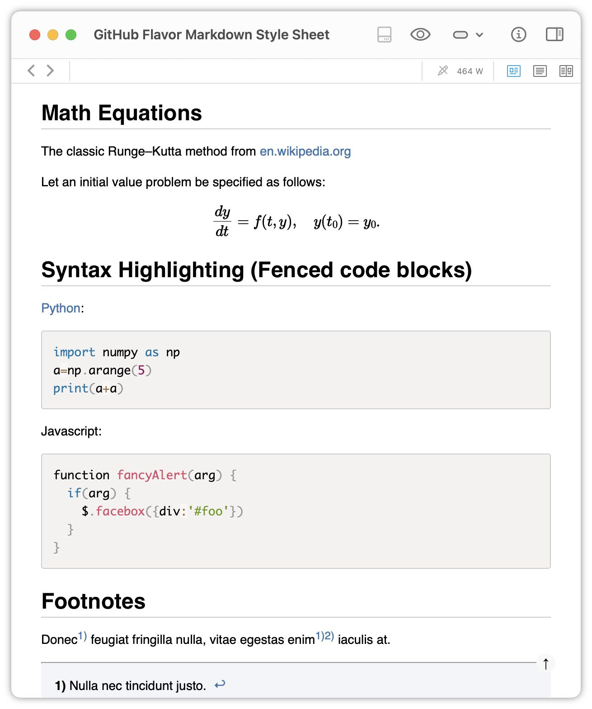
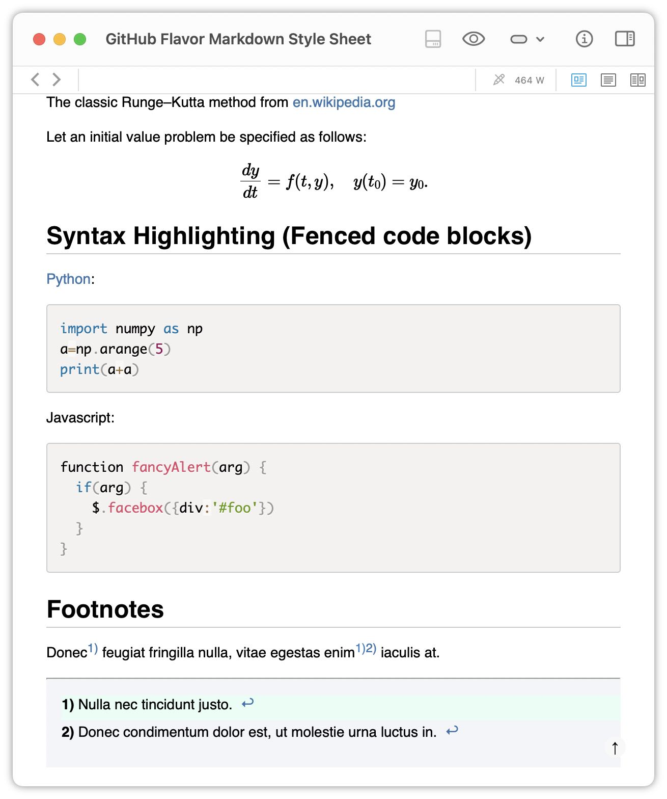

# GitHub Flavor Markdown Style Sheet
The following Markdown CSS is based on [Chris Patuzzo's](https://github.com/tuzz) [_github.css_](https://gist.github.com/tuzz/3331384). Feel free to further customize it. At the moment, there is only a "light version" available.


## Screenshots
In the following screenshots, the CSS was applied to DEVONthink Markdown files. DEVONthink uses _MultiMarkdown_. The source code is in the "Example Markdown file.md" file.









## Table of Contents and the floating Back-to-top button
The CSS contains style commands for a floating Back-to-top button and a formatted table of contents (TOC) layout. To add a TOC and to enable the floating Back-to-top button, add the following three command lines to your Markdown document (works for _MultiMarkdown_ only):

```html
<a class="top-link hide" href="#toc">↑</a>
<a name="toc"></a>
{{TOC:2-5}}
```

The TOC is placed right there, where you insert these commands (actually, where you insert the `{{TOC:2-5}}` statement). 

The implementation of the Back-to-top button is based on these two blog posts:
* [Morgan Smith, *How to add a sticky back-to-top button to your website*](https://getflywheel.com/layout/sticky-back-to-top-button-tutorial/)
* [Stephanie Eckles, _Pure CSS Smooth-Scroll "Back to Top"_](https://moderncss.dev/pure-css-smooth-scroll-back-to-top/)

### Floating Back-to-top button in DEVONthink To Go
To enable the Back-to-top button in DEVONthink To Go (DTTG), add the following custom CSS in the DTTG Markdown settings:

```css
@media screen and (prefers-reduced-motion: no-preference) {
  html {
    scroll-behavior: smooth;
  }
}

.TOC {
    background:     #272A2B none repeat scroll 0 0;
    border:         0px solid #aaa;
    border-radius:  15px;
    display:        table;
    font-size:      95%;
    color:          #0c9fd0;
    margin-bottom:  1em;
    padding-top:    1em !important;
    padding-right:  1em;//calc(100%-5px);
    width:          100%;
}

.TOC li, .TOC ul, .TOC ol, .TOC ul li, .TOC ol li{
    list-style:     decimal;
}

.TOC:before {
    content:        "Table of Contents";
    font-weight:    bold;
    font-size:      1.1em;
    color:          #0b88b2;
    padding-left:   1em;
    margin-bottom:  -1em;
}

.top-link {
    transition:     all .25s ease-in-out;
    position:       fixed;
    bottom:         0;
    right:          0;
    display:        inline-flex;
    color:          #000000;

    cursor:         pointer;
    align-items:    center;
    justify-content:center;
    margin:         0 2em 2em 0;
    border-radius:  50%;
    padding:        .25em;
    width:          1em;
    height:         1em;
    background-color: #F8F8F8;
}
```


<div style="text-align: center;">
<a href="Screenshots/Screenshot 8 DTTG Main text with TOC.jpg"></a>
<a href="Screenshots/Screenshot 9 DTTG Markdown settings menu.jpg"></a>

**Left**: The rendered Markdown text with a formatted TOC and a floating Back-to-top button (lower right corner). **Right**: DEVONthink To Go's Markdown settings menu, where you can insert custom CSS.
</div> 